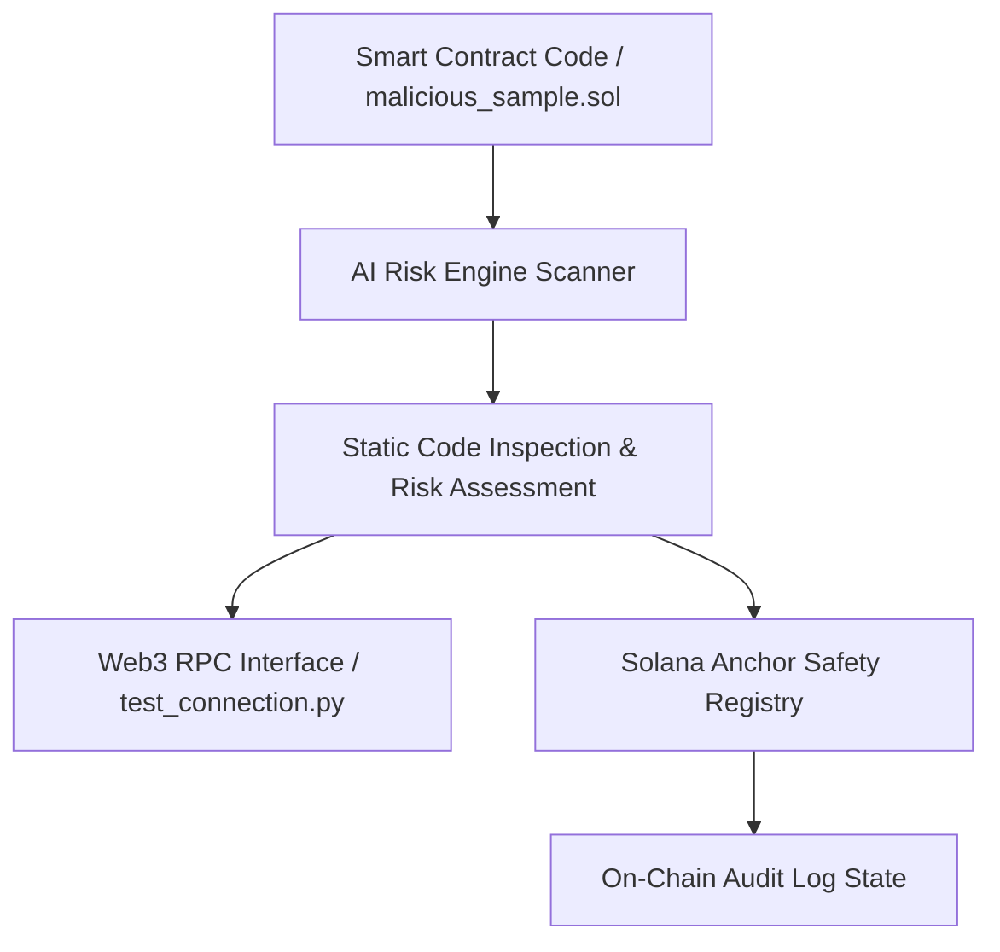

# GNN Smart Contract Auditor & Safety Registry

---

### Intellectual Property Notice

**Notice:**

This repository contains the public demonstration interface, documentation, and sample test contracts for evaluation purposes. The underlying BPF-to-graph extraction engine, TensorFlow-GNN training pipeline, and Rust safety-registry smart contracts are maintained in a private repository pending intellectual property filings.

---

## Repository Directory Structure

```text
.
├── ai_risk_engine/
│   ├── basic_scanner.py       # Static pattern & risk inspection script
│   ├── malicious_sample.sol   # Sample Solidity contract for security testing
│   └── test_connection.py    # Web3 / RPC connectivity test script
├── safety_registry/
│   └── safety_registry/      # Solana Anchor smart contract registry
│       ├── app/
│       └── Anchor.toml
├── .gitignore
└── requirements.txt
```

---

## System Architecture & Workflow



---

## Key Modules

- **AI Risk Engine (`ai_risk_engine/`):**

  Analyzes contract source code (.sol) for security anti-patterns and vulnerabilities while facilitating Web3 node communication.

- **Safety Registry (`safety_registry/`):**

  Solana program developed with the Anchor framework to record and query audit outcomes on-chain.

---

## Setup & Usage

1. **Environment Setup**

`pip install -r requirements.txt`

2. **Run the Static Vulnerability Scanner**

`python ai_risk_engine/basic_scanner.py`

3. **Test Web3 Connectivity**

`python ai_risk_engine/test_connection.py`
